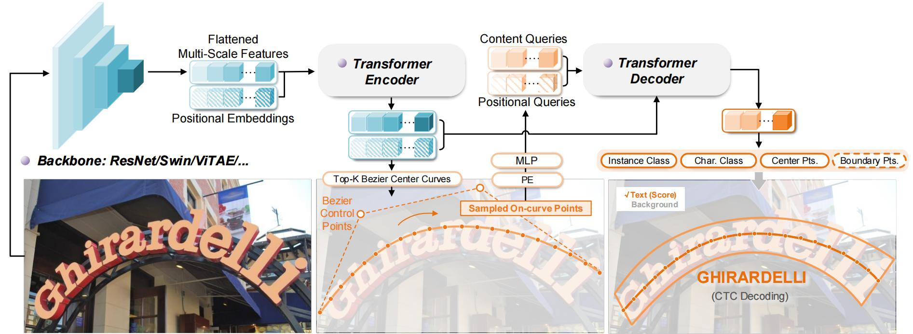
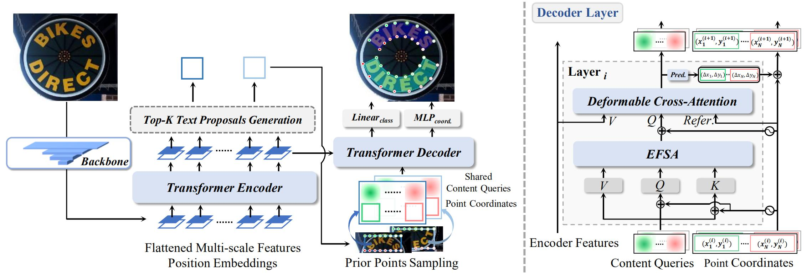

<h1 align="center">Scene Text Detection and Spotting</h1>

This repo contains a comprehensive list of our research works related to **scene text detection and spotting**. For any related questions, please contact <strong><a href="https://github.com/ymy-k/">Maoyuan Ye</a></strong> at [yemaoyuan@whu.edu.cn](mailto:yemaoyuan@whu.edu.cn) .

## Overview

[1. DeepSolo: Let Transformer Decoder with Explicit Points Solo for Text Spotting [CVPR-2023]](#deepsolo)

 

[2. DPText-DETR: Towards Better Scene Text Detection with Dynamic Points in Transformer [AAAI-2023]](#dptext)

 

[3. I3CL: Intra- and Inter-Instance Collaborative Learning for Arbitrary-shaped Scene Text Detection [IJCV-2022]](#i3cl)

  

## Projects

### 📘 DeepSolo: Let Transformer Decoder with Explicit Points Solo for Text Spotting [CVPR-2023]

<em>Maoyuan Ye&#8727;, Jing Zhang&#8727;, Shanshan Zhao, Juhua Liu, Tongliang Liu, Bo Du, and Dacheng Tao</em>.

[Paper](https://arxiv.org/abs/2211.10772) |  [Github Code](https://github.com/ViTAE-Transformer/DeepSolo) | [BibTex](./assets/CVPR_2023_DeepSolo/deepsolo.bib)

End-to-end text spotting aims to integrate scene text detection and recognition into a unified framework. Dealing with the relationship between the two sub-tasks plays a pivotal role in designing effective spotters. In this paper, we present DeepSolo, a succinct DETR-like baseline that lets a single decoder with explicit points solo for text detection and recognition simultaneously and efficiently. Quantitative experiments on public benchmarks demonstrate that DeepSolo outperforms previous state-of-the-art methods and achieves better training efficiency. In addition, DeepSolo is also compatible with line annotations.

***

### 📘 DPText-DETR: Towards Better Scene Text Detection with Dynamic Points in Transformer [AAAI-2023]

<em>Maoyuan Ye, Jing Zhang, Shanshan Zhao, Juhua Liu, Bo Du, and Dacheng Tao</em>.

[Paper](https://arxiv.org/abs/2207.04491) |  [Github Code](https://github.com/ymy-k/DPText-DETR) | [BibTex](./assets/AAAI_2023_DPText-DETR/dptext.bib)

Recently, Transformer-based methods, which predict polygon points or Bezier curve control points for localizing texts, are popular in scene text detection. However, these methods built upon detection transformer framework might achieve sub-optimal training efficiency and performance due to coarse positional query modeling. In addition, the point label form exploited in previous works implies the reading order of humans, which impedes the detection robustness from our observation. To address these challenges, this paper proposes DPText-DETR, which directly leverages explicit point coordinates to generate position queries and dynamically updates them in a progressive way. Moreover, we present an Enhanced Factorized Self-Attention module to improve the spatial inductive bias of non-local self-attention in Transformer. Furthermore, we design a simple yet effective positional label form to tackle the side effect of the previous form. To further evaluate the impact of different label forms on the detection robustness in real-world scenario, we establish an Inverse-Text test set containing 500 manually labeled images. Extensive experiments prove the high training efficiency, robustness, and state-of-the-art performance of our method on popular benchmarks

***

### 📘 I3CL: Intra- and Inter-Instance Collaborative Learning for Arbitrary-shaped Scene Text Detection [IJCV-2022]

<em>Bo Du, Jian Ye,  Jing Zhang, Juhua Liu, and Dacheng Tao</em>.

[Paper](https://arxiv.org/abs/2108.01343) |  [Github Code](https://github.com/ViTAE-Transformer/I3CL) | [BibTex](./assets/IJCV_2022_I3CL/i3cl.bib)

Existing methods for arbitrary-shaped text detection in natural scenes face two critical issues, i.e., (1) fracture detections at the gaps in a text instance; and (2) inaccurate detections of arbitrary-shaped text instances with diverse background context. To address these issues, we propose a novel method named Intra- and Inter-Instance Collaborative Learning (I3CL). Specifically, to address the first issue, we design an effective convolutional module with multiple receptive fields, which is able to collaboratively learn better character and gap feature representations at local and long ranges inside a text instance. To address the second issue, we devise an instance-based transformer module to exploit the dependencies between different text instances and a global context module to exploit the semantic context from the shared background, which are able to collaboratively learn more discriminative text feature representation. In this way, I3CL can effectively exploit the intra- and inter-instance dependencies together in a unified end-to-end trainable framework. Besides, to make full use of the unlabeled data, we design an effective semi-supervised learning method to leverage the pseudo labels via an ensemble strategy. Without bells and whistles, experimental results show that the proposed I3CL sets new state-of-the-art results on three challenging public benchmarks, i.e., an F-measure of 77.5% on ArT, 86.9% on Total-Text, and 86.4% on CTW-1500. Notably, our I3CL with the ResNeSt-101 backbone ranked the 1st place on the ArT leaderboard.

