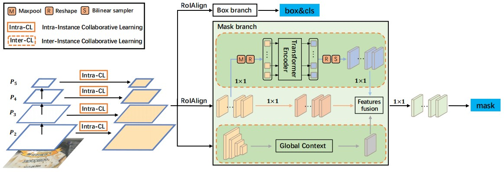
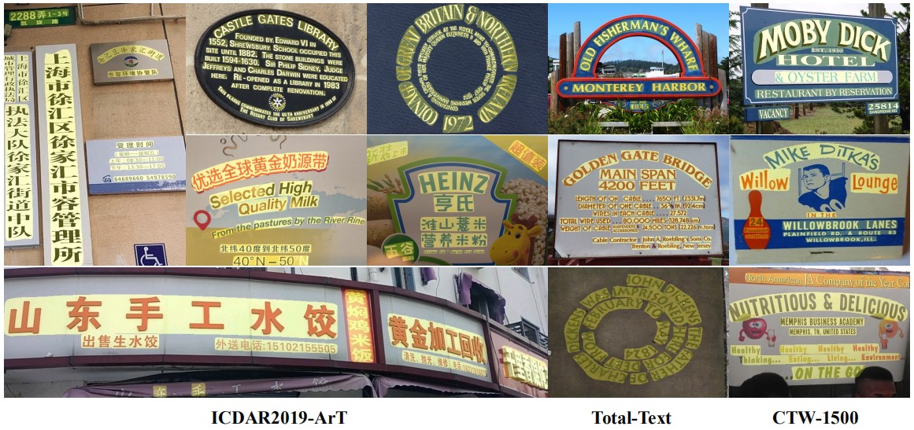

<h1 align="center"> I3CL: Intra- and Inter-Instance Collaborative Learning for Arbitrary-shaped Scene Text Detection </h1> 

<p align="center">
<a href="https://arxiv.org/abs/2108.01343">"></a>
</p>

<p align="center">
  <a href="#updates">Updates</a> |
  <a href="#introduction">Introduction</a> |
  <a href="#results">Results</a> |
  <a href="#usage">Usage</a> |
  <a href="#citation">Citation</a> |
  <a href="#acknowledgment">Acknowledgment</a>
</p >

*This is the repo for the paper "I3CL: Intra- and Inter-Instance Collaborative Learning for Arbitrary-shaped Scene Text Detection". 
Note that I3CL with ViTAEv2, ResNet50 and ResNet50 w/ RegionCL backbone are included.*

***

## Updates
>***[2022/04/13]*** Publish links of training datasets.
>
>***[2022/04/11]*** Add SSL training code for this implementation.
>
>***[2022/04/09]*** The training code for ICDAR2019 ArT dataset is uploaded. Private github repo temporarily.
>
> Other applications of ViTAE Transformer: [**Image Classification**](https://github.com/ViTAE-Transformer/ViTAE-Transformer/tree/main/Image-Classification) | [**Object Detection**](https://github.com/ViTAE-Transformer/ViTAE-Transformer/tree/main/Object-Detection) | [**Sementic Segmentation**](https://github.com/ViTAE-Transformer/ViTAE-Transformer/tree/main/Semantic-Segmentation) | [**Animal Pose Estimation**](https://github.com/ViTAE-Transformer/ViTAE-Transformer/tree/main/Animal-Pose-Estimation) | [**Matting**](https://github.com/ViTAE-Transformer/ViTAE-Transformer-Matting) | [**Remote Sensing**](https://github.com/ViTAE-Transformer/ViTAE-Transformer-Remote-Sensing)

## Introduction

Existing methods for arbitrary-shaped text detection in natural scenes face two critical issues, i.e., 1) 
fracture detections at the gaps in a text instance; and 2) inaccurate detections of arbitrary-shaped text
instances with diverse background context. To address these issues, we propose a novel method named 
Intra- and Inter-Instance Collaborative Learning (I3CL). Specifically, to address the first issue, we design 
an effective convolutional module with multiple receptive fields, which is able to collaboratively learn 
better character and gap feature representations at local and long ranges inside a text instance. To address 
the second issue, we devise an instance-based transformer module to exploit the dependencies between different 
text instances and a global context module to exploit the semantic context from the shared background, which 
are able to collaboratively learn more discriminative text feature representation. In this way, I3CL can 
effectively exploit the intra- and inter-instance dependencies together in a unified end-to-end trainable 
framework. Besides, to make full use of the unlabeled data, we design an effective semi-supervised learning 
method to leverage the pseudo labels via an ensemble strategy. Without bells and whistles, experimental results 
show that the proposed I3CL sets new state-of-the-art results on three challenging public benchmarks, i.e., 
an F-measure of 77.5% on ArT, 86.9% on Total-Text, and 86.4% on CTW-1500. Notably, our I3CL with the ResNeSt-101 
backbone ranked the 1st place on the ArT leaderboard.



## Results

Example results from paper.



Evaluation results of I3CL with different backbones on ArT. *Note that I3CL with ViTAE only adopt one step training stage with LSVT+MLT19+ArT training datasets in this repo. I3CL with ResNet series adopt three stage training strategy, i.e, pre-train on SynthText, mix-train on ReCTS+RCTW+LSVT+MLT19+ArT and lastly finetune on LSVT+MLT19+ArT*.

|Backbone|Model Link|Training Data|Recall|Precision|F-measure|
|:------:|:------:|:------:|:------:|:------:|:------:|
|<p>ViTAEv2<br>[this repo]</p>|<p>[OneDrive](https://1drv.ms/u/s!AimBgYV7JjTlgRH63hbJjWub5VMv?e=XUOrLb)/<br>[百度网盘](https://pan.baidu.com/s/1UQ8WUlk5dtRRJIKgZTWBXA) (pw:w754)</p>|LSVT,MLT19,ArT|**75.4**|82.8|78.9|
|<p>ResNet-50<br>[paper]</p>|-|SynthText,ReCTS,RCTW,LSVT,MLT19,ArT|71.3|82.7|76.6|
|<p>ResNet-50 w/ RegionCL(finetuning)<br>[paper]</p>|-|SynthText,ReCTS,RCTW,LSVT,MLT19,ArT|72.6|81.9|77.0|
|<p>ResNet-50 w/ RegionCL(w/o finetuning)<br>[paper]</p>|-|SynthText,ReCTS,RCTW,LSVT,MLT19,ArT|73.5|81.6|77.3|
|<p>ResNeXt-101<br>[paper]</p>|-|SynthText,ReCTS,RCTW,LSVT,MLT19,ArT|74.1|85.5|79.4|
|<p>ResNeSt-101<br>[paper]</p>|-|SynthText,ReCTS,RCTW,LSVT,MLT19,ArT|75.1|**86.3**|**80.3**|
|<p>ResNeXt-151<br>[paper]</p>|-|SynthText,ReCTS,RCTW,LSVT,MLT19,ArT|74.9|86.0|80.1|

## Usage

### Install

>**Prerequisites：**
>
>- Linux (macOS and Windows are not tested)
>- Python >= 3.6
>- Pytorch >= 1.8.1 (For ViTAE implementation). Please make sure your compilation CUDA version and runtime CUDA version match.
>- GCC >= 5
>- MMCV (We use mmcv-full==1.4.3)

1. Create a conda virtual environment and activate it. Note that This implementation is based on mmdetection 2.20.0.

2. Install Pytorch and torchvision following [official instructions](https://pytorch.org).

3. Install mmcv-full and timm. Please refer to [mmcv](https://github.com/open-mmlab/mmcv) to install the proper version. For example:
    
    ```
    pip install mmcv-full==1.4.3 -f https://download.openmmlab.com/mmcv/dist/cu111/torch1.9.0/index.html
    pip install timm
    ```

4. Clone this repository and then install it:
    
    ```
    git clone https://github.com/ViTAE-Transformer/ViTAE-Transformer-Scene-Text-Detection.git
    cd ViTAE-Transformer-Scene-Text-Detection
    pip install -r requirements/build.txt
    pip install -r requirements/runtime.txt
    pip install -v -e .
    ```

### Preparation

**Model:** 

- To train I3CL model yourself, please download the pretrained ViTAEv2 used in this implementation from here: [OneDrive](https://1drv.ms/u/s!AimBgYV7JjTlgRKwMDLQQ7QzPOJs?e=mzeeO4) | [百度网盘](https://pan.baidu.com/s/1su-IP6Gl1VJKBHfwtKIoow) (pw:petb). ResNet-50 w/ RegionCL(finetuning): [OneDrive](https://1drv.ms/u/s!AimBgYV7JjTlgRNs8EMQlB1SI6CO?e=KaSQtl) | [百度网盘](https://pan.baidu.com/s/1T2vmyQOpjzIfPveKKwZr-Q) (pw:y598). ResNet-50 w/ RegionCL(w/o finetuning): [OneDrive](https://1drv.ms/u/s!AimBgYV7JjTlgRTlX8j-HfnHNG6c?e=bixznC) | [百度网盘](https://pan.baidu.com/s/1_6nVTdxRpUi5kwp1MhTI9g) (pw:cybh). For backbone initialization, please put them in [pretrained_model/ViTAE](./pretrained_model/ViTAE) or [pretrained_model/RegionCL](./pretrained_model/RegionCL).
- Full I3CL model with ViTAE backbone trained on ArT can be downloaded and put in [pretrained_model/I3CL](./pretrained_model/I3CL).

**Data**

- We use coco format training datasets. Some offline augmented ArT training datasets are used. `lsvt-test` is only used to train SSL model. Files named `train_lossweight.json` are the provided pseudo-label for SSL training. You can download correspoding datasets in config file from here and put them in [data/](./data):

    |Dataset|<p>Link<br>(OneDrive)</p>|<p>Link<br>(Baidu Wangpan百度网盘)</p>|
    |:------:|:------:|:------:|
    |art|[Link](https://1drv.ms/u/s!AimBgYV7JjTlae-oSHbbwqD-H8o?e=Whjdff)|[Link](https://pan.baidu.com/s/1QC61NvqjQfoEvGozE1eadA) (pw:etif)|
    |art_light|[Link](https://1drv.ms/u/s!AimBgYV7JjTlae-oSHbbwqD-H8o?e=KJUhgt)|[Link](https://pan.baidu.com/s/1u_O4AywAu_FBfkpjJN2IFQ) (pw:mzrk)|
    |art_noise|[Link](https://1drv.ms/u/s!AimBgYV7JjTlduE-ISGfYF5d9Qs?e=0xWzIv)|[Link](https://pan.baidu.com/s/1rgc-1C6SD4gOm8h5qK7Yxw) (pw:scxi)|
    |art_sig|[Link](https://1drv.ms/u/s!AimBgYV7JjTlbdAx1ZOCpvmYkBE?e=NNxguj)|[Link](https://pan.baidu.com/s/1bSJ321LNl7IISXra24f6eA) (pw:cdk8)|
    |lsvt|[Link](https://1drv.ms/u/s!AimBgYV7JjTlae-oSHbbwqD-H8o?e=EjB9d5)|[Link](https://pan.baidu.com/s/1UTdD8fcdyXXdQMzfMBbHoQ) (pw:wly0)|
    |lsvt_test|[Link](https://1drv.ms/u/s!AimBgYV7JjTldfOea-7Wcc_uVSE?e=I1IgvU)|[Link](https://pan.baidu.com/s/14y3W0XRCuqDboSXMlXTtJw) (pw:8ha3)|
    |icdar2019_mlt|[Link](https://1drv.ms/u/s!AimBgYV7JjTlbtKKo7-IFG32Yo4?e=XprWJb)|[Link](https://pan.baidu.com/s/1vHN6i4iTtUsDMa6eR7Py0Q) (pw:hmnj)|
    |rctw|[Link](https://1drv.ms/u/s!AimBgYV7JjTlgRawI3dSiEOhp6Is?e=D7MktG)|[Link](https://pan.baidu.com/s/1b6_pV1McdntgtudjdtVTLA) (pw:ngge)|
    |rects|[Link](https://1drv.ms/u/s!AimBgYV7JjTlgRWNyPwC5a04c-vX?e=hKK4az)|[Link](https://pan.baidu.com/s/1wp1Qrm28Ycr4s-Asl4-x6Q) (pw:y00o)|

    The file structure should look like:
    ```
    |- data
        |- art
        |   |- train_images
        |   |    |- *.jpg
        |   |- test_images
        |   |    |- *.jpg
        |   |- train.json
        |   |- train_lossweight.json
        |- art_light
        |   |- train_images
        |   |    |- *.jpg
        |   |- train.json
        |   |- train_lossweight.json
        ......
        |- lsvt
        |   |- train_images1
        |   |    |- *.jpg
        |   |- train_images2
        |   |    |- *.jpg
        |   |- train1.json
        |   |- train1_lossweight.json
        |   |- train2.json
        |   |- train2_lossweight.json
        |- lsvt_test
        |   |- train_images
        |   |    |- *.jpg
        |   |- train_lossweight.json
        ......

### Training

- Distributed training with 4GPUs for **ViTAE** backbone:
```
python -m torch.distributed.launch --nproc_per_node=4 --master_port=29500 tools/train.py \
configs/i3cl_vitae_fpn/i3cl_vitae_fpn_ms_train.py --launcher pytorch --work-dir ./out_dir/${your_dir}
```

- Distributed training with 4GPUs for **ResNet50** backbone:

```
step1:
python -m torch.distributed.launch --nproc_per_node=4 --master_port=29500 tools/train.py \
configs/i3cl_r50_fpn/i3cl_r50_fpn_ms_pretrain.py --launcher pytorch --work-dir ./out_dir/art_r50_pretrain/
step2:
python -m torch.distributed.launch --nproc_per_node=4 --master_port=29500 tools/train.py \
configs/i3cl_r50_fpn/i3cl_r50_fpn_ms_mixtrain.py --launcher pytorch --work-dir ./out_dir/art_r50_mixtrain/
step3:
python -m torch.distributed.launch --nproc_per_node=4 --master_port=29500 tools/train.py \
configs/i3cl_r50_fpn/i3cl_r50_fpn_ms_finetune.py --launcher pytorch --work-dir ./out_dir/art_r50_finetune/
```

- Distributed training with 4GPUs for **ResNet50 w/ RegionCL** backbone:

```
step1:
python -m torch.distributed.launch --nproc_per_node=4 --master_port=29500 tools/train.py \
configs/i3cl_r50_regioncl_fpn/i3cl_r50_fpn_ms_pretrain.py --launcher pytorch --work-dir ./out_dir/art_r50_regioncl_pretrain/
step2:
python -m torch.distributed.launch --nproc_per_node=4 --master_port=29500 tools/train.py \
configs/i3cl_r50_regioncl_fpn/i3cl_r50_fpn_ms_mixtrain.py --launcher pytorch --work-dir ./out_dir/art_r50_regioncl_mixtrain/
step3:
python -m torch.distributed.launch --nproc_per_node=4 --master_port=29500 tools/train.py \
configs/i3cl_r50_regioncl_fpn/i3cl_r50_fpn_ms_finetune.py --launcher pytorch --work-dir ./out_dir/art_r50_regioncl_finetune/
```

*Note:*

- *If the GPU memory is limited during training I3CL ViTAE backbone, please adjust `img_scale` in 
[configuration file](./configs/i3cl_vitae_fpn/coco_instance.py). The maximum scale set to (800, 1333) is proper for V100(16G) while 
there is little effect on the performance actually. Please change the training scale according to your condition.*

### Inference

For example, use our trained I3CL model to get inference results on ICDAR2019 ArT test set with visualization images, 
txt format records and the json file for testing submission, please run:

```
python demo/art_demo.py --checkpoint pretrained_model/I3CL/vitae_epoch_12.pth --score-thr 0.45 --json_file art_submission.json
```

*Note:*
 - Upload the saved json file to [ICDAR2019-ArT evaluation website](https://rrc.cvc.uab.es/?ch=14) for Recall, Precision and F1 evaluation results. 
 Change the path for saving visualizations and txt files if needed.

## Citation

This project is for research purpose only.

If you are interested in our work, please consider citing our work.

Please post issues to let us know if you encounter any problems.

## Acknowledgement

Thanks for [mmdetection](https://github.com/open-mmlab/mmdetection).
